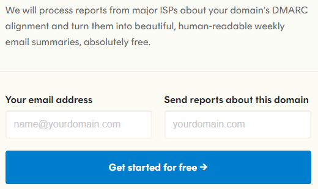

# Email security pitfalls 

In the previous posts of this email security series, we showed how delegating SPF or DKIM can lead to risk of spoofing:

* Part 1: [All Your SPF Includes Are Belong To Us](https://improsec.com/tech-blog/arebelongtous)
* Part 2: [Phish'n'Chimps: email spoofing via marketing and CRM platforms](https://improsec.com/tech-blog/phishnchimps-mail-spoofing-via-marketing-and-crm-platforms)

This post depicts more common email security pitfalls regularly seen on customer assessments. These mistakes usually expose the customer to a loss of confidentiality or increase the risk of an attacker being able to compromise the email infrastructure (often, for phishing purposes).

This post also includes recommendations to reduce the email attack surface.

## Pitfall #1: Email security reports communicated to untrusted third-parties

The DMARC DNS record contains two directives that receiving email servers use to send reports back to the sending email server upon SPF or DKIM failure:

* `rua=` for "Aggregate reports"
* `ruf=` for "Failure reports"

These report types both contain information that should be kept private but the criticality of the data according to the [RFC 7489](https://datatracker.ietf.org/doc/html/rfc7489) is not the same.

Aggregate reports (`rua`) should include:

```
   o  The DMARC policy discovered and applied, if any

   o  The selected message disposition

   o  The identifier evaluated by SPF and the SPF result, if any

   o  The identifier evaluated by DKIM and the DKIM result, if any

   o  For both DKIM and SPF, an indication of whether the identifier was
      in alignment

   o  Data for each Domain Owner's subdomain separately from mail from
      the sender's Organizational Domain, even if there is no explicit
      subdomain policy

   o  Sending and receiving domains

   o  The policy requested by the Domain Owner and the policy actually
      applied (if different)

   o  The number of successful authentications

   o  The counts of messages based on all messages received, even if
      their delivery is ultimately blocked by other filtering agents
```

Failure reports (`ruf`) should include:

```
   Whether the failure is due to an infrastructure problem or the
   message is inauthentic, failure reports also provide more information
   about the failed message than is available in an aggregate report.

   These reports SHOULD include any URI(s) from the message that failed
   authentication.  These reports SHOULD include as much of the message
   and message header as is reasonable to support the Domain Owner's
   investigation into what caused the message to fail authentication and
   track down the sender.
```

The latter is far more interesting for a potential attacker.

This risk is underlined in the security considerations of the [RFC 7489 section 9.1](https://datatracker.ietf.org/doc/html/rfc7489#section-9.1):

```
9.1.  Data Exposure Considerations

   Aggregate reports are limited in scope to DMARC policy and
   disposition results, to information pertaining to the underlying
   authentication mechanisms, and to the identifiers involved in DMARC
   validation.

   Failed-message reporting provides message-specific details pertaining
   to authentication failures.  Individual reports can contain message
   content as well as trace header fields.  Domain Owners are able to
   analyze individual reports and attempt to determine root causes of
   authentication mechanism failures, gain insight into
   misconfigurations or other problems with email and network
   infrastructure, or inspect messages for insight into abusive
   practices.
   
   Both report types may expose sender and recipient identifiers (e.g.,
   RFC5322.From addresses), and although the AFRF format used for
   failed-message reporting supports redaction, failed-message reporting
   is capable of exposing the entire message to the report recipient.
```

The exact data disclosed in these reports is up to the receiving email server, but reports may therefore include information such as:
* Sender email
* Recipient email
* Timestamp
* Subject field
* Entire email body

Many third-party services exist which analyzes these reports, here is one such service:


When assessing risks of specific DMARC policy services, remember the quote: "*if you're not paying for the product, you are the product*".

The risk is therefore, that this information could be disclosed to a third-party.

In some cases, we see both `rua=` and `ruf=` being used with third-parties domains that are intended but it is not rare to get feedback from customers not knowing what these reports are, what they contain or from where they were sent.

We recommend checking if both aggregate and failure reports are sent to a third-party, that it is authorized by the company to receive such reports and that it is done in compliance with GDPR regulations for EU countries.

That check can be automatized by checking if there is a `rua=` or `ruf=` directive in the DMARC record for a domain and if it does not contain the domain name itself:

With bash:
```bash
domain="mydomain.com"; dig +short txt "_dmarc.$domain" | grep -E "(rua=|ruf=)[^ ]+" | grep -Ev "$domain"
```

With PowerShell:
```powershell
$domain="mydomain.com"; (Resolve-DnsName -Type TXT -Name "_dmarc.$domain").strings -split '; ' | Select-String "(rua=|ruf=)" | Select-String -NotMatch $domain
```

An example output:
```
rua=mailto:a94kf63j@ag.dmarcian-eu.com
ruf=mailto:a94kf63j@fr.dmarcian-eu.com
```

### Recommendation
We recommend reviewing the current DMARC settings to check for reports being sent to third-parties. If so, it is important to check this is a wanted behavior and that the third-party is in conformance with the law (for example, GDPR does not allow sending such reports to non-EU countries in some cases).

## Pitfall #2: DMARC loose configuration

We often observe that DMARC configuration is not set up properly. It is usually too loose, leading to increased email security attack surface.

Note that the below does not cover all DMARC directives, only the ones we usually not see being configured properly. Other ones can also bring security (e.g. `aspf=`/`adkim=`) but depend more on the organization's custom choices.

#### policy

The `p=` directive stands for "policy" and this is the final decision the receiving system will take regarding accepting or blocking emails. Policy should be set to either `p=quarantine` or `p=reject`. What we see most of the time though is `p=none` which is an equivalent to letting all email go through even if other mechanisms such as SPF or DKIM have failed.

In Denmark, there are [minimum technical requirements for state authorities](https://sikkerdigital.dk/myndighed/tekniske-tiltag/tekniske-minimumskrav) that include a DMARC doctrine. It states that `p=reject` is mandatory for the institutions' domains:

```markdown
* DMARC REJECT policy is implemented on all domains belonging to the authority

DMARC is a validation system designed to prevent so-called email spoofing, where one sender impersonates another. The solution also provides a good mitigation against sending spam from the authority's domains.

Following by: CFCS - Reduce the risk of fraudulent emails

Must be implemented on: July 1, 2020
```

If you inspect all Danish state authorities' DMARC you will however still find some not complying with this requirement.

Auditing 268 domains of Danish public institutions we found 123 to either have no DMARC or not set the DMARC directive `p=reject`.

#### sub-policy

The `sp=` directive applies to all sub-domains and can be different from the `p=` directive. It will however default to the `p=` directive. Therefore, it is recommended to assess whether sub-domains should have a different policy.

#### sampling rate

The `pct=` directive allow for DMARC to be applied to only a given percentage of the emails that are received. For example, `pct=25` in a configuration would result in the policy being applied on only one out of four emails. `pct=` should not being set to any other value than 100 except during DMARC implementation. 100 is the default if no `pct=` directive is specified.

### Recommendation
To sum up:
* Use `p=quarantine` or `p=reject`.
* Leave `sp=` out of DMARC unless needed, or explicitly set `sp=quarantine` or `sp=reject`.
* Leave `pct=` out of DMARC, or explicitly set `pct=100`. Use only non-100 values during implementation phases.

## Pitfall #3: External sender warning messages bypass

You have probably already seen headers or footers in emails with a sentence such as "This email was sent by an external address". This is used as a sort of phishing awareness message to end users by companies. Unfortunately, many of those messages are added to the email via HTML and where there is HTML, there is CSS.
It is thus possible to hide such HTML-based messages by setting the CSS accordingly as demonstrated by [@ldionmarcil](https://twitter.com/ldionmarcil/status/1384987686113583107) thus totally bypassing the protection it provides.
We regularly see customers as well as third-parties providing email defence products with these HTML-based messages.

### Recommendation

We recommend never trusting the HTML provided by someone else in emails. Instead, these types of awareness messages could be raised by the email user agent, for example Outlook has a [native external sender callouts on email](https://techcommunity.microsoft.com/t5/exchange-team-blog/native-external-sender-callouts-on-email-in-outlook/ba-p/2250098) for adding a ribbon that is directly integrated to the interface and not an HTML addition.

## Pitfall #4: Denylisting of attachment filetypes

### Denylists

Most email defences middleboxes we encounter are configured to block attachment in emails according to their filetypes with a denylist. For example, the denylist could be:

* exe
* dll
* vbs

The issue with denylisting is that attackers regularly find new code-execution capable filetypes that are not in the list, bypassing the security it provides. Bypassing the above denylist can be done with the following filetypes:

* jar
* hta
* cmd, bat
* ...

### Recommendation

Instead of a denylist, the solution is to use an allowlist, that only authorize explicitly defined filetypes. This prevent future attackers' findings on execution-capable filetypes and allow for more control on what should go through the email infrastructure and what should be blocked.

If an allowlist is not possible (but please try), block as many file types as possible. Use an extensive list such as [filesec.io](https://filesec.io/) and stay up to date with new extensions used in attacks.

### The Microsoft Office documents issue

Microsoft Office documents are, as of today, one of the most common initial access technique for cyberattacks because of their code-execution capabilities (VBA macros). Most organizations need such document filetypes for business purposes so blocking it would not be acceptable.
This sounds incompatible with the previous recommendation but does not have to be.

There are several options to address this issue:

* Block macros in documents from the internet ([A setting which is currently a hot topic](https://www.bleepingcomputer.com/news/microsoft/microsoft-rolls-back-decision-to-block-office-macros-by-default/))
* Require VBA macros to be digitally signed by a trusted publisher
* Strip VBA macros from received documents
* Only allow Office filetypes that cannot execute code such as .docx, .xlsx, pptx, 

## Pitfall #5: SMTP encryption and clear-text authentication

SMTP encryption is only optional according to standards, but it is also mandatory to allow unencrypted communications to happen when owning a public server because no RFC require TLS support. Hence encryption of emails is a best-effort system due to legacy and backward-compatibility reasons.

We still see numerous SMTP servers of customers configured without an option for upgrade to TLS connections or with clear-text authentication methods.

When checking SMTP server, it should be ensured that the `STARTTLS` command is available:

```bash
$ nc -C improsec-com.mail.protection.outlook.com 25 
220 VE1EUR01FT034.mail.protection.outlook.com Microsoft ESMTP MAIL Service ready at Mon, 4 Jul 2022 12:14:15 +0000
EHLO attacker
250-VE1EUR01FT034.mail.protection.outlook.com Hello [x.x.x.x]
250-SIZE 157286400
250-PIPELINING
250-DSN
250-ENHANCEDSTATUSCODES
250-STARTTLS                  <== here 
250-8BITMIME
250-BINARYMIME
250-CHUNKING
250 SMTPUTF8
```

To check what TLS versions are allowed, a lot of online services can be used such as [LuxSci SMTP checker](https://luxsci.com/smtp-tls-checker#results). It will negotiate TLS connections with various parameters behind the scenes.

A SMTP server with authentication methods such as `PLAIN` or `LOGIN` is also a risk as these allow for clear-text authentication:

```
220 esmtp.example.com ESMTP  
ehlo client.example.com  
250-esmtp.example.com  
250-PIPELINING  
250-8BITMIME  
250-SIZE 255555555  
250 AUTH LOGIN PLAIN CRAM-MD5    <== here
auth login  
334 VXNlcm5hbWU6  
avlsdkfj  
334 UGFzc3dvcmQ6  
lkajsdfvlj  
535 authentication failed (#5.7.1)
```

### Recommendation

We recommend enabling**** `STARTTLS` and disabling clear-text legacy authentication methods such as `PLAIN` and `LOGIN`.

## Pitfall #6: Loose SPF record

We have previously shown that it is possible to spoof email addresses, i.e., sending an email with a forged sender address ([All Your SPF Includes Are Belong To Us](https://improsec.com/tech-blog/arebelongtous)). 

This is a result of having a too extensive list of IP addresses and domains authorized to send emails in the SPF record. However, keeping track and 
only including trusted IP addresses and domains as authorized domains in the SPF record, is just one aspect of a proper hardened SPF record. 

What we found is that many Danish domains have a less strict SPF record. That is, many domains use the "softfail" attribute in their SPF record, denoted by `~all`. 

```bash
$ dig +short TXT mydomain.com | grep spf
v=spf1 include:spf.protection.outlook.com ~all
```

The above example only authorizes Microsoft Office 365 to send emails. Emails from other senders are not rejected but forwarded to a spam folder. 
Thus, it also raises the risk that users may still open spoofed or potentially malicious emails. Using the "softfail" attribute does make sense 
for testing purposes but not for permanent use.

### Recommendation 

Compile a list of email servers that are authorized to send email on behalf of the domain. Then update the SPF record 
with the correct email authorization list and use the "hardfail" attribute `-all`.

What the "hardfail" specifies is that other senders, those not listed in the SPF record, are unauthorized and that their emails are discarded.

## Pitfall #7: Unused domains for email

Attackers often spoof non-mail sending domains to get around an organization’s defenses. Thus, it is also important to secure those domains that are **not** actively used for email.

### Recommendation

Publish a null SPF record for domains not used for emails to clearly declare the domain does not send any emails. 

```
v=spf1 -all
```

## Conclusion
Email security is a complex topic involving both network protocol security as well as cryptography skills, but also one of the most common ingression vector of malware as of today.

The above pitfalls are just a few of the many misconfigurations and missing hardening one can make when implementing email services in an organization.

We therefore highly recommend defending this perimeter with
* Reviewing both the DNS records forming the SPF/DKIM/DMARC triad
* Secure configuration of email servers
* Assessing the implemented technical controls, e.g. with penetration tests dedicated to email security