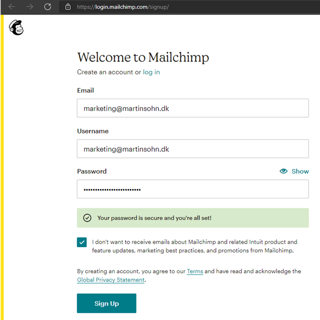
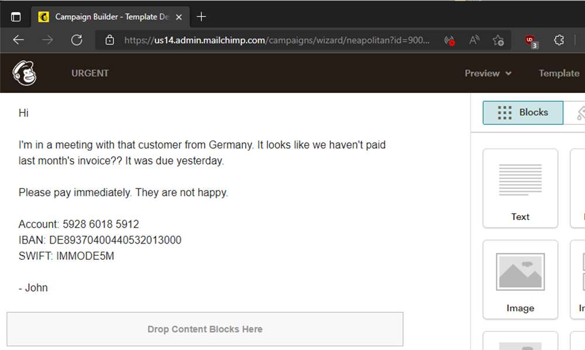

# Phish'n'Chimps - mail spoofing via marketing and CRM platforms

This is part two of a three part mail security series. Check out part 1:  [All your SPF includes are belong to us](https://improsec.com/tech-blog/arebelongtous).

This post describes how insecure practices by services such as marketing and CRM platforms enables mail spoofing, which especially can be a risk for the platforms' customers.

In short, the risk is that some platforms allow anyone who can sign up (requires clicking a confirmation link sent via mail) to send mails as any other sender/user of that domain (e.g. bob@example.com signs up, but can send from john@example.com).

This can lead to an effective phishing mail that passes spam filters. For example with Mailchimp:
1. bob@example.com signs up and sends a mail as john@example.com.
2. The mail will pass SPF as Mailchimp servers may send the SMTP command `helo=mail252.suw101.mcdlv.net`, and subdomains of `mcdlv.net` publish SPF records that contain IPs of Mailchimp sending servers - all that's required to pass SPF.
3. The mail will pass DKIM if the official Mailchimp DKIM records `k2._domainkey.example.com` and `k3._domainkey.example.com` already existed for the domain (e.g. `marketing@example.com` already created an account and asked DNS admins to create the records). These records are recommended by Mailchimp to be configured and the DKIM keys are the same for all Mailchimp accounts/customers.
4. The mail will pass DMARC because either SPF or DKIM was passed.

The root cause of this risk is that the platforms allow changing the sender to arbitrary ones for the same domain. Additionally, the risk is increased as the mails may be passing DKIM and DMARC for existing customers of the platforms.

Here are some scenarios in which a threat actor may be able to sign up from an organization's domain:

* Bob becomes a malicious insider.
* Bob has a weak password, and his mailbox is compromised via webmail password spraying.
* Bob is socially engineered into signing up by clicking or forwarding the Mailchimp verification link.
* Bob has malware on his system, and the threat actors compromises the mailbox via keylogging.

If you use Mailchimp or Outfunnel and just want steps to address the risk, please jump to the **Recommendations** section. If you use a different platform, I recommend checking the table below, and if your provider has not been tested, then test for this risk yourself.

I suspected this risk to be widespread and tested 14 marketing platforms. I found two to be vulnerable up to the point of exploitation (MailChimp and Outfunel), and one to have a partial vulnerability (SendGrid). Testing was done by either by first studying the platforms’ documentation for how they handle mail/domain validation and signing up and attempting exploitation for those which I believed were vulnerable. The test results are:

| Platform       | Believe vulnerable (based on docs) | Vulnerable (based on test) | Reported | Fixed   |
|----------------|------------------------------------|----------------------------|----------|---------|
| Mailchimp      | Yes                                | Yes                        | Yes      | No      |
| Outfunnel      | Yes                                | Yes                        | Yes      | No      |
| SendGrid       | Maybe                              | Partially                  | Yes      | Unknown |
| CovertKit      | Yes                                | No                         |          |         |
| GetResponse    | No                                 | No                         |          |         |
| Sendblue       | No                                 | No                         |          |         |
| ActiveCampaign | No                                 | Not tested                    |          |         |
| Aweber         | No                                 | Not tested                    |          |         |
| MailerLite     | No                                 | Not tested                    |          |         |
| Mailjet        | No                                 | Not tested                    |          |         |
| Moosend        | No                                 | Not tested                    |          |         |
| Omnisend       | No                                 | Not tested                    |          |         |
| Zoho           | No                                 | Not tested                    |


## Timeline

**Mailchimp**

* May, 2021: Vulnerability discovered by Jeffrey Bencteux, vulnerability research and disclosure handed off to Martin Sohn Christensen
* June 7, 2021: Bugcrowd submission via Mailchimp website form
* June 8, 2021: Bugcrowd marked submission as N/A
* June 15, 2021: Challenged Bugcrowd's decision
* June 28, 2021: Asked for update on Bugcrowd
* April 4, 2022: Informing Mailchimp of publicizing intentions via abuse mail
* April 4, 2022: Informing Bugcrowd of publicizing intentions
* April 8, 2022: Mailchimp security team (whitehat@mailchimp.com) replies that Bugcrowd submissions was mislabelled
* April 11, 2022: Bugcrowd submission changed to Triaged
* April 28, 2022: Bugcrowd acknowledged risk and closed as **informational**
* April 28, 2022: Mailchimp security team replies:
	* "*At this point, we do not consider your finding a high risk security vulnerability that requires immediate action.*"
	* "*We track various abuse vectors and have not currently seen this being abused to a significant degree. We have additional controls in place that reduce the risk of the likelihood of the vulnerability you shared.*"
* April 28, 2022: Challenged Mailchimp's decision. No reply
* May 5, 2022: Informed about free mail provider issues. No reply

**Outfunnel**

* July 2, 21: Informed Outfunnel security team (security@outfunnel.com)
* June 23,2021: Asked for update
* July 23,2021: Outfunnel implicitly replies that the risk accepted and will not be addressed:
	* "*DKIM, SPF and DMARC have never meant to be used for account level protection but domain level protection, so it does not matter what is the user part of the email address. These standards only verify the domain part and in this case, this is exactly what happens. In fact only few email servers limit user part of the address to the actual account owner. For example the majority of Postfix based email systems allow to use any From address and as the message is signed according to the domain, not the user, then these emails also get properly signed even though the sender was some other user. For user level protection you would need to sign the message with user's key, eg S/MIME or PGP.*"

That DKIM, SPF, DMARC isn't account level protection is true, however using those S/MIME and PGP for newsletters seems infeasible and the mechanisms are not built into Outfunnel.

## Demonstration

I will demonstrate the Mailchimp risk based on the following fictive company:
* marketing@example.com (Marketing department)
* bob@example.com (arbitrary employee)
* john@example.com (CEO)
* accounting@example.com (Accounting department)

Note: The tests have been done with my personal domain (martinsohn.dk), but the text will use the `example.com` domain.

### Marketing newsletters - the legitimate use

Marketing signs up for Mailchimp to be used for newsletters.



Marketing receives a verification link and clicks it. The account is now created.


Mailchimp customers are not required, but recommended, to *authenticate* domains they will send newsletters from in order to reduce risk of being flagged as spam ([described in Mailchimp documentation](https://mailchimp.com/en-gb/help/set-up-email-domain-authentication/)). For this, the CNAME records `k2._domainkey.example.com` and `k3._domainkey.example.com` should be added to the customer domain newsletters are sent from, so that Mailchimp can sign newsletters with DKIM:


Marketing creates and sends a newsletter campaign:


The compaign lands in the subscriber's inbox:


### Threat actor steps in - the vulnerability is exploited

A Mailchimp account is now created with an arbitrary mailbox of the same domain:


As the non-unique CNAME record/DKIM keys already exists, the threat actor can perform *domain authentication* (in reality clicking the 'Start Authentication' button is not required, as Mailchimp will automatically identify the existing DKIM keys and authenticate the domain after some time):


The threat actor creates a campaign, which is a phishing mail to the Accounting department:



The threat actor changes the sender of the campaign to john@example.com and sends it (notice the 'From' field is changed):


The phishing mail lands in the Accounting inbox. The Outlook mail user agent adds John's picture, creating more trust in the received phishing mail:


The result is a very believable phishing mail... but notice that footer 🤔

### Removing Mailchimp 'required' footer

Mailchimp describes the reason of the footer as "*Anti-spam laws and our Terms Of Use require you to include certain information in every email campaign you send*":


But as mails are HTML it could be possible to alter the footer. A known phishing technique is to remove 'External sender' warning headers by adding CSS to the mail ([demonstration by @ldionmarcil](https://twitter.com/ldionmarcil/status/1384987686113583107)).

Here we add CSS to set 'display:none' on any footer element IDs.


.. and it worked, Mailchimp did not prevent hiding the footer via CSS:


### Passing SPF, DKIM, and DMARC

On top of the mail user agent adding John's picture, this technique is effective for phishing as the anti-spam mechanisms SPF, DKIM, and DMARC all can 'pass'. At the time of testing, the domain used had the following DNS records:

* SPF
	* `v=spf1 include:spf.protection.outlook.com -all`
* DKIM (created during test)
	* `k2._domainkey.martinsohn.dk =CNAME=> dkim2.mcsv.net`
	* `k3._domainkey.martinsohn.dk =CAME=> dkim2.mcsv.net`
* DMARC
	* `v=DMARC1; p=reject; rua=mailto:dmarcreports@martinsohn.dk; aspf=s; adkim=s;`
* MX
	* `martinsohn-dk.mail.protection.outlook.com`

The full mail headers of a mail sent as an exploitation demo can be found at the bottom of the post. The headers show that SPF passed:

```
Received-SPF: Pass (protection.outlook.com: domain of mail252.suw101.mcdlv.net
 designates 198.2.184.252 as permitted sender)
 receiver=protection.outlook.com; client-ip=198.2.184.252;
 helo=mail252.suw101.mcdlv.net;
```

DKIM passed:

```
dkim=pass (signature was verified)
```

DMARC passed:
```
 header.d=martinsohn.dk;dmarc=pass action=none
 header.from=martinsohn.dk;compauth=pass reason=100
```

## Free mail providers

As we can change the sender of the domain, I thought maybe free mail provider domains could be a target. I queried a bunch of mail provider domains if they have Mailchimp DKIM keys, but none did.

But we can still change the sender, and fail at minimum DKIM. When testing, Mailchimp stated that domains of free mail providers were allowed:


However, they fail to deny sign ups from other free mail providers such as @protonmail.com:


Therefore, signing up with bob@protonmail.com allows you to send mails from john@protonmail.com from Mailchimp servers. I did test this and the mail was sent, however DKIM failed as predicted.

I did not dig into if 'free' is literal and Mailchimp accept signups from paid mail providers.

## Quantifying risk

To quantify the number of domains at risk, I audited 268 Danish governmental root domains relating to e.g. political parties, ministries, municipalities, and cities.

I found 32 domains (12%) to have published the Mailchimp DKIM records on their root domain. No domains were identified to use Outfunnel.

A description of the risk was disclosed to the 32 organisations prior to the disclosure of this post.

## Recommendations

### For users/organizations

* Check if your domains have Mailchimp DKIM keys - query DNS TXT records `k2._domainkey.yourdomain.com` and `k3._domainkey.yourdomain.com`. If DKIM keys are returned, the domain is at risk.
* If you are a Mailchimp or Outfunnel customer, please raise your concerns to them.
* Use a platform that requires **individual** sender verification. That is, the platform does not allow sending from any mail address unless the address is verified with a confirmation link or code sent to that address, or to a known mail address of that domain such as postmaster@example.com.
	* Test the platform if in doubt.
* Use subdomains (newsletter.example.com) or a dedicated root domain (examplenews.com) for sending mails via third parties.
	* In case of subdomains, also enable DMARC’s strict DKIM alignment.

### For platform operators

* Do not allow sending from any mail address unless the address is verified with a confirmation link or code sent to that address, or to a known mail address of that domain such as postmaster@example.com.
* Use a unique DKIM selector for every account or domain.
* Optional: require subdomain as sender.
	* and verify DMARC strict DKIM alignment has been configured.

## Mail header from Mailchimp exploitation

This mail was sent from the Mailchimp user bob@martinsohn.dk, who changed the sender to be john@martinsohn.dk and sent a marketing campaign mail to accounting@martinsohn.dk.

```
Authentication-Results: spf=pass (sender IP is 198.2.184.252)
 smtp.mailfrom=mail252.suw101.mcdlv.net; dkim=pass (signature was verified)
 header.d=martinsohn.dk;dmarc=pass action=none
 header.from=martinsohn.dk;compauth=pass reason=100
Received-SPF: Pass (protection.outlook.com: domain of mail252.suw101.mcdlv.net
 designates 198.2.184.252 as permitted sender)
 receiver=protection.outlook.com; client-ip=198.2.184.252;
 helo=mail252.suw101.mcdlv.net;
Received: from mail252.suw101.mcdlv.net (198.2.184.252) by
 DB8EUR05FT024.mail.protection.outlook.com (10.233.239.191) with Microsoft
 SMTP Server (version=TLS1_2, cipher=TLS_ECDHE_RSA_WITH_AES_256_GCM_SHA384) id
 15.20.5164.19 via Frontend Transport; Sat, 16 Apr 2022 16:45:37 +0000
DKIM-Signature: v=1; a=rsa-sha256; c=relaxed/relaxed; d=martinsohn.dk; s=k3;
  t=1650127536; x=1650429936; i=john@martinsohn.dk;
  bh=fgC38+u6EAPPkt0qmpcIMe74WeuFs1sd34Zw+M4bE0I=;
  h=Subject:From:Reply-To:To:Date:Message-ID:X-MC-User:Feedback-ID:
   List-ID:List-Unsubscribe:List-Unsubscribe-Post:Content-Type:
   MIME-Version:CC:Date:Subject;
  b=f/QQI/aH2h[...]zd+afw==
Received: from localhost (localhost [127.0.0.1])
  by mail252.suw101.mcdlv.net (Mailchimp) with ESMTP id 4KgfFr4pMPzBsThvN
  for <accounting@martinsohn.dk>; Sat, 16 Apr 2022 16:45:36 +0000 (GMT)
Subject: =?utf-8?Q?URGENT?=
From: =?utf-8?Q?John=20Doe?= <john@martinsohn.dk>
Reply-To: =?utf-8?Q?John=20Doe?= <john@martinsohn.dk>
To: <accounting@martinsohn.dk>
Date: Sat, 16 Apr 2022 16:45:36 +0000
```